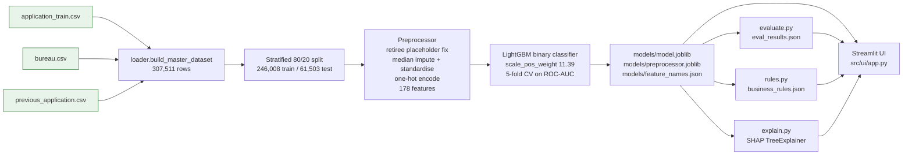
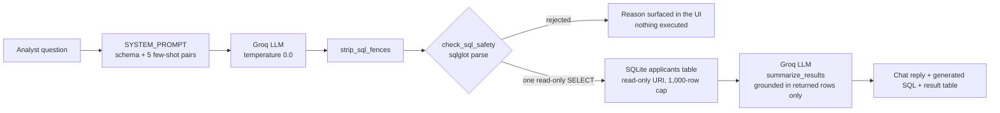

# Credit Risk Intelligence Platform

Default-risk scoring over 307,511 Home Credit consumer loan applications, with a
LightGBM model, SHAP explanations, and readable surrogate rules behind a Streamlit UI.
A "Talk to Data" page turns plain-English questions into validated SQLite queries via Groq,
so an analyst can interrogate the portfolio without writing SQL.

## Architecture

Modelling pipeline, from the three source CSVs to the artifacts the UI reads:



Natural-language querying (every generated statement is parsed and rejected before it can
reach the database):



## Folder structure

```
credit_risk_platform/
├── data/                       # source CSVs and credit_risk.db (git-ignored, volume-mounted)
├── models/                     # model.joblib, preprocessor.joblib, *.json artifacts
├── sql/schema.sql              # generated DDL for the applicants table
├── notebooks/eda.py            # writes PNG + JSON charts to documents/screenshots/
├── documents/screenshots/      # chart exports the EDA page reloads
├── src/
│   ├── data/
│   │   ├── loader.py           # reads the three CSVs, aggregates and joins them
│   │   └── preprocessor.py     # sklearn Preprocessor + data-quality report
│   ├── ml/
│   │   ├── train.py            # fits LightGBM, writes the artifacts
│   │   ├── evaluate.py         # holdout metrics -> eval_results.json
│   │   ├── predict.py          # load_model_artifacts(), predict_risk()
│   │   ├── explain.py          # SHAP local + global explanations
│   │   └── rules.py            # surrogate decision tree -> business_rules.json
│   ├── talk_to_data/
│   │   ├── prompt_templates.py # schema description + few-shot examples
│   │   ├── nl_to_sql.py        # Groq client, fence stripping, sqlglot safety check
│   │   └── query_runner.py     # builds the DB, runs queries, summarises results
│   ├── ui/app.py               # the entire Streamlit app, six pages
│   └── utils/                  # config.py (env vars), logger.py
├── tests/test_data_pipeline.py
├── Dockerfile
├── docker-compose.yml
└── .env.example
```

## Setup

### Docker (primary)

Put `application_train.csv`, `bureau.csv`, and `previous_application.csv` in `data/`, copy
`.env.example` to `.env` and add your Groq key, then:

```bash
docker compose up -d --build      # first build takes ~4 minutes
```

Open <http://localhost:8501>. `./data` and `./models` are bind-mounted, so the container
reads the artifacts and the database from your working copy. Retraining never requires an
image rebuild, only `docker compose restart`. Use `docker compose logs -f` to follow output
and `docker compose down` to stop.

If `models/` or `data/credit_risk.db` are empty, bootstrap them through the same image so
you do not need a local Python environment at all:

```bash
docker compose run --rm app python -m src.ml.train
docker compose run --rm app python -m src.ml.evaluate
docker compose run --rm app python -m src.ml.rules
docker compose run --rm app python -m src.talk_to_data.query_runner --rebuild
docker compose restart
```

`requirements.txt` is pinned deliberately: `model.joblib` and `preprocessor.joblib` are
pickles, and loading them under a different scikit-learn minor version fails outright
(`SimpleImputer` gained an internal attribute between 1.7 and 1.9). The Dockerfile also
installs `libgomp1`, which LightGBM loads at import time and `python:3.11-slim` omits.

### Local development (fallback)

```bash
python -m venv .venv && .venv\Scripts\activate     # PowerShell; use source .venv/bin/activate on Unix
pip install -r requirements.txt
cp .env.example .env                               # then add GROQ_API_KEY
python -m src.ml.train                             # models/*.joblib + feature_names.json
python -m src.ml.evaluate                          # models/eval_results.json
python -m src.ml.rules                             # models/business_rules.json
python notebooks/eda.py                            # chart exports for the EDA page
python -m src.talk_to_data.query_runner --rebuild  # sql/schema.sql + data/credit_risk.db
streamlit run src/ui/app.py
```

### Tests

```bash
python -m unittest tests.test_data_pipeline tests.test_sql_safety -v   # 17 tests
```

`tests/test_data_pipeline.py` (6 tests) covers the loader aggregations and the left join that
keeps applicants with no credit history, the `DAYS_EMPLOYED` placeholder handling and column
dropping, and the risk band edges with the borderline margin.
`tests/test_sql_safety.py` (11 tests) covers the `check_sql_safety()` gate, asserting that
`DROP`, `DELETE`, multi-statement strings, `PRAGMA`, `ATTACH`, reads of `sqlite_master`, an
`INSERT` nested inside a subquery, `SELECT ... INTO`, and unparseable text are all refused
with a stated reason, and that a plain `SELECT`, a CTE, and a `UNION` of two `SELECT`s are
accepted.

Both files are pure and offline: they build their own fixtures and need neither the source
CSVs, the database, nor a Groq key. `tests/` has no `__init__.py`, so `unittest discover`
cannot import it. Use the module paths above. The suite also runs locally only, since
`tests/` is excluded from the image by `.dockerignore`.

Environment variables are read in exactly one place, `src/utils/config.py`:
`GROQ_API_KEY`, `GROQ_BASE_URL`, `LLM_MODEL`, `DB_PATH`, `RISK_THRESHOLD_LOW`,
`RISK_THRESHOLD_HIGH`. Compose overrides `DB_PATH` to the absolute
`/app/data/credit_risk.db`.

## Model rationale

**Why LightGBM.** The task is tabular, wide, mostly numeric after encoding, heavily missing,
and mildly non-linear: the regime gradient-boosted trees dominate. It handles the raw
`EXT_SOURCE` distributions without transformation, needs no interaction terms to pick up
things like a high credit-to-income multiple mattering more for younger applicants, and
trains on 246,008 rows in seconds, which is what made a 5-fold CV loop affordable on this
timeline. One quirk worth noting from `train.py`: LightGBM rejects feature names containing
JSON metacharacters and the one-hot columns include values like `"Spouse, partner"`, so the
matrix is passed positionally and the names are kept in `feature_names.json` instead.

**Why `scale_pos_weight`.** Only 8.07% of applicants defaulted. Left alone, a boosted tree
minimising log-loss on an 11.4:1 split learns that predicting "will repay" is almost always
right and produces well-calibrated but useless probabilities that never cross a decision
threshold. `scale_pos_weight` is set from the observed negative-to-positive ratio
(**11.38711**, computed at training time rather than hardcoded), which reweights the
gradient so the minority class contributes proportionally. Resampling was rejected in favour
of reweighting: SMOTE would synthesise applicants in a 178-dimensional one-hot space where
interpolated rows are not plausible people, and undersampling would throw away most of the
246,008 training rows.

**Why no logistic-regression baseline.** A baseline is normally carried for
interpretability: a transparent reference for sanity-checking what the complex model keys
on. LightGBM's own gain-split importance and the SHAP values already surface that directly,
so a second model would add training and maintenance time without adding rigour. The
importance ranking is printed at the end of every training run for exactly this purpose.

**Data-quality decisions that shaped the features.** `DAYS_EMPLOYED = 365243` is a retiree
placeholder, not a 1,000-year tenure; the preprocessor nulls it before median imputation and
preserves the signal as the binary `is_retiree_placeholder` feature. Columns above 65%
missing are dropped: 65% rather than 70% because the sparse housing columns
(`COMMONAREA_AVG` and friends) top out at 69.87% missing and would otherwise all survive the
cut. That removes 19 columns, and `ORGANIZATION_TYPE` is additionally excluded as
high-cardinality, leaving 178 model features.

## Metrics

From `models/eval_results.json`, on the held-out 20% split (61,503 rows, 8.07% positive):

| Metric | Value |
| --- | --- |
| ROC-AUC (holdout) | 0.7670 |
| PR-AUC (holdout) | 0.2555 |
| ROC-AUC (5-fold CV, train split) | 0.7602 ± 0.0012 |
| Train / test rows | 246,008 / 61,503 |
| Model features | 178 |
| `scale_pos_weight` | 11.38711 |

Threshold choice matters more than the headline AUC here, because reweighting shifts the
probability scale:

| Threshold | Precision | Recall | F1 | TN | FP | FN | TP |
| --- | --- | --- | --- | --- | --- | --- | --- |
| 0.50 (default) | 0.1760 | 0.6719 | 0.2790 | 40,924 | 15,614 | 1,629 | 3,336 |
| 0.67 (best F1) | 0.2617 | 0.4119 | 0.3200 | 50,768 | 5,770 | 2,920 | 2,045 |

The risk bands are what the UI actually shows, and they separate real default rates cleanly
(a 9.6× spread from the Low to the High band):

| Band | Applicants | Share | Actual default rate |
| --- | --- | --- | --- |
| Low (p < 0.3) | 25,127 | 40.85% | 2.28% |
| Medium (0.3 ≤ p < 0.6) | 24,311 | 39.53% | 7.17% |
| High (p ≥ 0.6) | 12,065 | 19.62% | 21.95% |

Any score within 0.05 of a band edge is additionally flagged `borderline_review`, so cases
near a cut-off are routed to a human instead of being auto-decisioned on the wrong side of a
rounding error.

## Prompt engineering

**Few-shot strategy.** The system prompt is assembled in `prompt_templates.py` from three
parts: an explicit per-column schema description, a note listing the bulk columns that exist
but are rarely useful, and five question/SQL example pairs. The examples are chosen to cover
distinct query *shapes* rather than distinct topics (a plain `GROUP BY`, a filtered
aggregate, a rate calculation, a ranking with `HAVING` and `LIMIT`, and a `CASE`-based
comparison), because that is what the model needs to generalise from. Ten numbered rules
encode the conventions that examples alone did not enforce reliably: express default rates
as `ROUND(AVG(TARGET) * 100, 2)`, always report `COUNT(*)` beside a grouped rate so the
reader can judge sample size, and prefer the pre-derived helper columns (`age_years`,
`credit_to_income`, `income_quartile`) over recomputing from the negative `DAYS_*`
encodings. The schema description is the model's only view of the database, so it is
deliberately explicit about the encodings that are easy to get wrong: negative day counts,
the `365243` placeholder, and `TARGET` polarity. Generation runs at `temperature=0.0` and is
stateless: no conversation history is carried between calls.

Summarisation is a second, separately-prompted call. `SUMMARY_SYSTEM_PROMPT` allows only
numbers present in the returned rows, forbids rounding beyond the given precision, and
requires the model to say plainly when a query returned nothing or failed rather than
guessing an answer. Empty results and errors get their own user-prompt variants so the model
is told what happened instead of inferring it from an empty CSV.

**SQL safety validation.** No generated string is trusted. `check_sql_safety()` parses it
with **sqlglot** in SQLite dialect and rejects anything that is not exactly one read-only
`SELECT` (or `UNION`) against the `applicants` table. It walks the full AST, so
`INSERT`/`UPDATE`/`DELETE`/`DROP`/`ALTER`/`CREATE`/`TRUNCATE`, `SELECT ... INTO`, and
`PRAGMA`/`ATTACH`/`VACUUM` (which parse to a `Command` node) are caught even when nested in
a subquery; multi-statement strings are rejected by count; and table references are
whitelisted against `applicants` with CTE names resolved separately, which blocks reads of
`sqlite_master`. Rejections return a human-readable reason that the UI shows instead of
executing anything. Two further layers sit behind it: the connection is opened with a
`file:...?mode=ro` URI, and every query is wrapped to cap results at 1,000 rows.

**Why Groq.** Latency is the whole user experience on a chat page: a question triggers two
sequential LLM calls, so anything slower than roughly a second per call feels broken. Groq's
inference speed keeps the round trip short, its free tier covers demo-scale traffic at no
cost, and its OpenAI-compatible endpoint means the client is swappable if this ever needed a
different provider. For a lightweight demo over a single well-described table, a hosted
open-weight model is entirely sufficient; the task is schema-constrained SQL generation, not
open-ended reasoning. The default is `openai/gpt-oss-120b`. Note that
`llama-3.3-70b-versatile` has been decommissioned by Groq and now returns
`model_not_found`. To see what your key can reach:

```bash
python -c "from src.talk_to_data.nl_to_sql import get_client; print([m.id for m in get_client().models.list().data])"
```

## Business rules

A depth-4 decision tree (`min_samples_leaf=500`, 16 leaves) is fitted as a surrogate for the
LightGBM model. Crucially it is trained on the model's *predicted risk bands*, not the raw
target, so the resulting if-then rules describe what the model does, and the fidelity score
says how faithfully they do it.

Four of the 16 rules from the `standard` variant, with real coverage and outcomes:

| Rule | Condition | Band | Coverage | Actual default rate |
| --- | --- | --- | --- | --- |
| 1 | `EXT_SOURCE_3 ≤ 0.305` and `EXT_SOURCE_2 ≤ 0.413` and `EXT_SOURCE_1 ≤ 0.582` | High | 10,115 (4.11%) | 26.05% |
| 3 | `EXT_SOURCE_3 ≤ 0.155` and `EXT_SOURCE_2 > 0.413` | High | 6,455 (2.62%) | 17.94% |
| 10 | `EXT_SOURCE_3` in 0.316–0.536 and `EXT_SOURCE_2` in 0.413–0.677 | Medium | 57,293 (23.29%) | 7.18% |
| 16 | `EXT_SOURCE_3 > 0.536` and `EXT_SOURCE_2 > 0.617` and `EXT_SOURCE_1 > 0.335` | Low | 38,790 (15.77%) | 2.33% |

Two variants are produced at the same depth and stored under separate keys, so the UI can
present the tradeoff rather than picking one silently:

| Variant | Class weights | Holdout fidelity | High band | Medium band | Low band |
| --- | --- | --- | --- | --- | --- |
| `standard` | none | **66.41%** | 41.06% | 69.98% | 75.12% |
| `risk_focused` | balanced | **62.12%** | 80.73% | 38.35% | 76.19% |

`standard` is the better general-purpose approximation, and its holdout fidelity (66.41%)
tracks its training fidelity (66.24%), so the tree is not overfitting. `risk_focused` gives
up roughly four points of overall agreement to nearly double its coverage of the High band,
which is the right trade when a missed default costs more than a false alarm.

One caveat worth stating alongside the rules: the tree splits almost entirely on the three
`EXT_SOURCE` columns, with time in current employment the only other feature it uses. That
matches the SHAP ranking, so it is a real property of the model rather than an artefact of
the surrogate, but it does mean the rules are largely a restatement of the external bureau
scores.

## Known limitations

- **The surrogate rules are an approximation, not the model.** At 66.41% holdout agreement,
  roughly one applicant in three is placed in a different band by the rules than by
  LightGBM, and agreement on the High band is only 41.06%. They are a communication and
  policy-review tool. They are not a substitute for scoring, and they should not be used to
  make decisions on their own.
- **SHAP is local attribution, not causation.** A SHAP value says how much a feature moved
  *this model's* output for *this applicant* relative to a baseline, given the other feature
  values. It does not say that changing the feature in the real world would change the
  outcome. Because the `EXT_SOURCE` scores are themselves correlated bureau summaries,
  attribution is shared among them somewhat arbitrarily, and the tree-path approximation
  assumes a feature independence that does not hold here.
- **NL-to-SQL is single-table only.** The safety check whitelists exactly one table, and the
  database is a single denormalised `applicants` view. Questions requiring genuine
  loan-level or bureau-record-level joins ("how did this applicant's bureau balances change
  over time?") cannot be expressed: the CSVs are pre-aggregated to one row per applicant
  during loading, so that detail is not in the database at all.
- **No conversation memory.** Every question is answered from scratch. Follow-ups like "and
  for women only?" will fail because the previous turn is not in context.
- **`DAYS_EMPLOYED` is handled, other dataset quirks may not be.** The `365243` placeholder
  is explicitly detected and preserved as a feature, and columns above 65% missing are
  dropped. Given the timeline, other known Home Credit oddities were not individually
  audited: `CODE_GENDER = 'XNA'`, `NAME_FAMILY_STATUS = 'Unknown'`, and
  `NAME_INCOME_TYPE` categories with only a handful of rows survive as one-hot columns;
  extreme `AMT_INCOME_TOTAL` outliers are standardised but not winsorised; and the
  `_AVG`/`_MODE`/`_MEDI` building statistics are near-duplicates of each other that were
  left in rather than deduplicated.
- **Metrics come from one random split.** `random_state=42`, a single 80/20 holdout. The CV
  spread is tight (±0.0012), but there is no repeated-split or temporal validation, and the
  dataset has no time dimension to validate against. The cross-validated 0.7602 is also
  mildly optimistic, because the preprocessor is fitted on the full training split before
  cross-validation, so each fold's validation rows are not fully held out from the
  imputation and scaling statistics; wrapping `Preprocessor` and `LGBMClassifier` in a
  scikit-learn `Pipeline` and cross-validating that would fix it.
- **F1 is not the ideal objective for a lending decision threshold.** A missed default and a
  wrongly declined good customer carry different real costs, and F1's implicit symmetry does
  not capture that; an expected-cost threshold with a stated cost ratio would be more
  defensible than the 0.67 reported above.

### Fairness consideration

`CODE_GENDER` and `NAME_FAMILY_STATUS` are explicit model inputs, surviving as one-hot
columns among the 178 features. Sex and marital status are prohibited bases for credit
decisions under regulations such as the US Equal Credit Opportunity Act and its implementing
Regulation B, so their presence is a disparate-treatment problem and not only a question of
disparate impact. Scoring the full population shows the effect:

| Gender | Applicants | Actual default rate | Mean predicted probability | Placed in High band |
| --- | --- | --- | --- | --- |
| F | 202,448 | 7.00% | 0.3578 | 15.59% |
| M | 105,059 | 10.14% | 0.4460 | 28.18% |

The model places men in the High band at 1.8× the rate of women, against an actual default
gap of 10.14% versus 7.00%, so some of that separation reflects genuine signal that
correlated features would carry regardless. A production version would retrain without these
protected attributes and validate that the AUC cost is small before shipping. Four rows also
carry `CODE_GENDER = 'XNA'`, which survives as its own one-hot column.

## Future improvements

- **Multi-table joins.** Keep `bureau` and `previous_application` at their native
  granularity in SQLite alongside the denormalised view, widen the safety whitelist to the
  additional tables, and extend the schema prompt with the join keys. That unlocks
  per-record questions and richer sequence features for the model.
- **Conversation memory for the chatbot.** Carry a bounded window of prior turns into
  `nl_to_sql()` so follow-up questions resolve, with the generated SQL from the previous
  turn included as context. The safety check does not change; only the prompt does.
- **Response caching.** Cache question → SQL and SQL → result-set separately (keyed by
  normalised question text and by statement hash), which removes both LLM calls for repeated
  questions and makes the demo feel instant.
- **Drift monitoring.** Log scored applicants, track the population stability index on the
  `EXT_SOURCE` features and the predicted band distribution against the training baseline,
  and alert when the score distribution shifts. The model has no retraining trigger today.
- **Calibration.** Reweighting distorts the probability scale, which is why the F1-optimal
  threshold sits at 0.67 rather than 0.5. Fitting an isotonic or Platt calibrator on a
  validation split would make `default_probability` interpretable as an actual expected
  default rate, which matters if the score is ever used for pricing rather than ranking.
